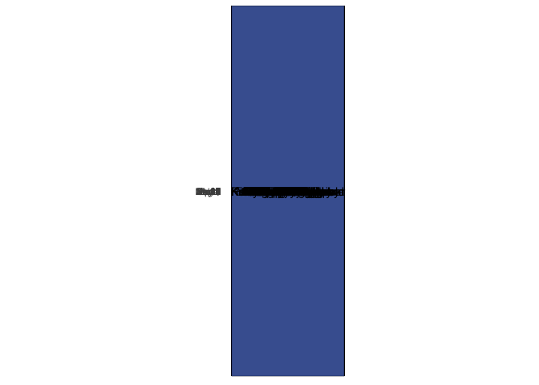
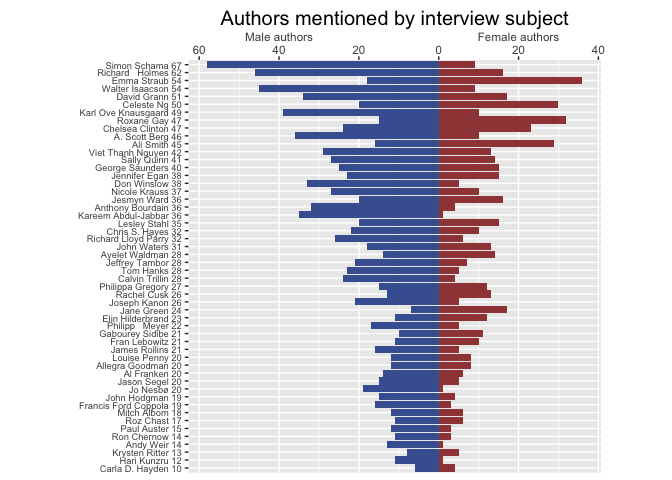
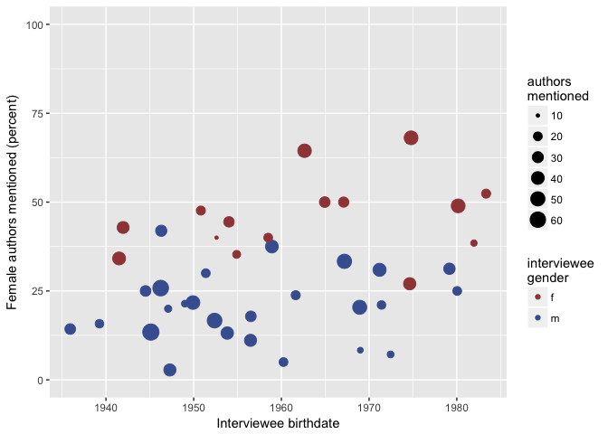
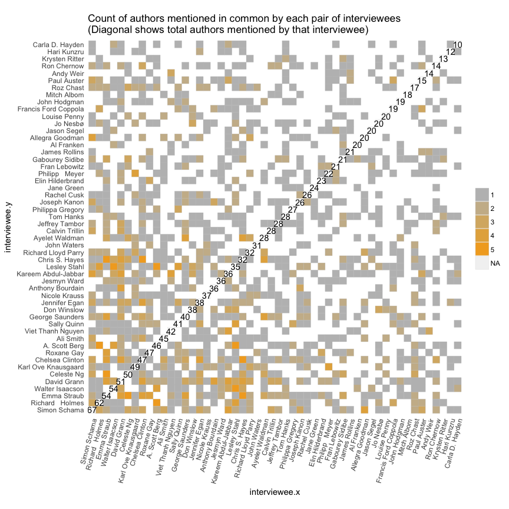

    ## Warning: package 'purrr' was built under R version 3.4.2

New York Times "By The Book" Interviews
---------------------------------------

Interview dates: **December 1, 2016 - December 14, 2017**

Total interviews: **54**

Total unique authors mentioned: **1267**

The New York Times Book Review's "By the Book" feature is a weekly interview exploring reading habits past, present, and planned. The interviews yield author recommendations - an average of **32** authors mentioned by name in each interview. The dataset analyzed below is a result of code that looks at the text of each interview, identifies strings of text that look like author names, and verifies them by looking for corresponding names in the Goodreads author database. The gender and birthdate information comes from the data in the Goodreads database, with missing data filled in from the authors' Wikipedia pages.

### Gender

There were a total of **24** female interviewees and **30** male interviewees.

Male interviewees are more likely to mention male authors. Female interviewees mention men and women at about the same rate.

But there is wide variation among interviewees in the total number of authors mentioned & in the gender split.

Older interviewees are both more likely to be male (**64%** of male interviewees were born before 1960, vs **47%** of female interviewees) and more likely to have recommended a lower percentage of female authors.

### Frequently mentioned authors

This data has a long tail - there are **1267** unique authors mentioned across the **54** interviews, and **1032** of them are only mentioned once. The most frequently mentioned authors are mentioned by a fifth of all interviewees. The chart below shows the most frequently mentioned authors, the number of times they were mentioned, and the dates they were mentioned.

Below we can see instances where two interviewees mentioned the same author. Note that although some interviewees mentioned dozens of authors, the maximum overlap in authors mentioned between any two interviewees was **6**.

We can also see how many times pairs of authors were mentioned together in the same interview.

